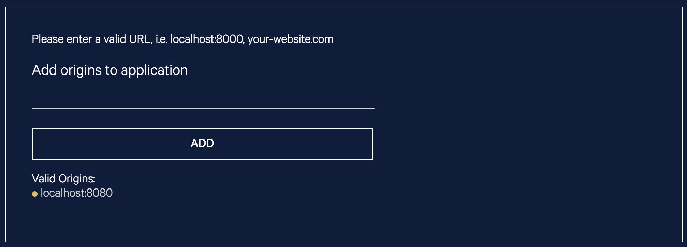

# Chirp and Azure IoT Central MXChip provision web service

A standalone web browser application for provisioning MXChip devices onto Azure IoT Central using the Chirp SDK for data over sound.

## Contents

A web browser based application served up by a simple node.js server.  All the source code for the web application (HTML, JavaScript) along with the source for the node.js server and content is provided in this directory.

## How to use

Install the following pre-requisits:

* [node.js](https://nodejs.org/en/download/)

Before we can run the page we need to get the application key from [Chirp developer web site](https://developers.chirp.io) and then paste the application key into the web-content/iotchirp.js source code at line 18.  

```Javascript
  // Hello from Chirp - please go to https://developers.chirp.io and get a Chirp Application Key
  window.Chirp = new ChirpConnect('<Chirp application key>', audioContext);
```

Whilst you are at the Chirp developer site you will also need to add the origin of your application to satisfy CORS rules.  Just add http://localhost:8080 click the 'ADD' button and then remember to click the 'Save' button.  You should end up with the following shown:



From the command line in this directory run the command:

```bash
npm install
node server.js
```

The node server should now be running and you can load the provisioning page from [here](http://localhost:8080/chirp.html).  You are now ready to provision your MXChip device onto Azure IoT Central.

Go to [Azure IoT Central](https://aka.ms/iotcentral) and create a new application, you can get a free application for seven days to try this out no commitment, no creditcard, just free!  When creating your application choose the 'Sample Devkits' template.  Once your application is provisioned you can click on the device explorer button on the left and then click the 'MXChip (1.0.0) template in the first column.  Click the '+ New' button and select 'Real' and a new physical device will be added to your device explorer.  To get the connection string for the device click the 'Connect this device' button in the top left corner and pop up dialog appears.  Click the 'Copy' button on the Primary connection string so the value is in the clipboard.  Now return back to the Azure IoT Central MXChip Configuration web page.

Load the Chirp MXChip firmware image onto your MXChip device and power it on. The device will initially be in listening mode. Go to your IoT Central application and copy the connection string for your device. Paste the connection string into the form, fill in your WiFi SSID and password, along with the six digit PIN from the MXChip devices screen. Make sure your computer speakers are turned up to a comfortable listening level. Finally, press the "Send Data" button and listen for the Chirps. Your device should now connect to your WiFi and begin sending data to IoT Central.

If you run into issues please click the troubleshooting link at the bottom of the page and see if any of the suggestions hep you.  If you still have problems then please contact us through the issues page in the Github repository and we will try to get you a solution as soon as possible.  The troubleshooting page is a living document and we will update it as we resolve user issues.

## Status

This project is provided to illustrate how you can utilize the Chirp SDK on MXChip to provision devices to services like Azure IoT Central using data transmission over sound.  This project is not designed to be production ready but provided as a sample of how to build the Chirp feature into your firmware.

## Reporting Security Issues

Security issues and bugs should be reported privately, via email, to the Microsoft Security
Response Center (MSRC) at [secure@microsoft.com](mailto:secure@microsoft.com). You should
receive a response within 24 hours. If for some reason you do not, please follow up via
email to ensure we received your original message. Further information, including the
[MSRC PGP](https://technet.microsoft.com/en-us/security/dn606155) key, can be found in
the [Security TechCenter](https://technet.microsoft.com/en-us/security/default).

## Contributing

This project welcomes contributions and suggestions.  Most contributions require you to agree to a
Contributor License Agreement (CLA) declaring that you have the right to, and actually do, grant us
the rights to use your contribution. For details, visit https://cla.microsoft.com.

When you submit a pull request, a CLA-bot will automatically determine whether you need to provide
a CLA and decorate the PR appropriately (e.g., label, comment). Simply follow the instructions
provided by the bot. You will only need to do this once across all repos using our CLA.

This project has adopted the [Microsoft Open Source Code of Conduct](https://opensource.microsoft.com/codeofconduct/).
For more information see the [Code of Conduct FAQ](https://opensource.microsoft.com/codeofconduct/faq/) or
contact [opencode@microsoft.com](mailto:opencode@microsoft.com) with any additional questions or comments.
